# WOHL REACTIONS COSMETIC STORE — System Diagrams

> **Project:** Wohl Reactions Cosmetic Store
> **Stack:** Angular 19 + Node.js/Express + MongoDB
> **Prepared by:** Navadiya Vishwa (124), Sutariya Bhavik (134), Kikani Nitanshu (156)
> **Guide:** Ms. Sanskruti Ramani
> **College:** Sutex Bank College of Computer Applications & Science, Amroli

---

## Table of Contents

| # | Diagram | Description |
|---|---------|-------------|
| 1 | System Architecture | Three-tier architecture overview |
| 2 | Entity-Relationship Diagram | Database entities and relationships |
| 3 | Data Flow Diagram — Level 0 | Context-level system boundary |
| 4 | Data Flow Diagram — Level 1 | Detailed process decomposition |
| 5 | User Authentication Flow | Login & registration sequence |
| 6 | Order Placement Flow | Cart to order lifecycle |
| 7 | Admin Authentication Flow | Admin login & session management |
| 8 | Product Management Flow | Admin CRUD operations on products |
| 9 | Frontend Component Hierarchy | Angular component tree |
| 10 | Service Dependency Map | Frontend services and their interactions |
| 11 | API Route Map | All REST API endpoints |
| 12 | Angular Routing Diagram | Frontend route structure |
| 13 | Cart & Wishlist Flow | Add-to-cart and wishlist operations |
| 14 | Deployment Architecture | Server and build layout |

---

## 1. System Architecture (Three-Tier)

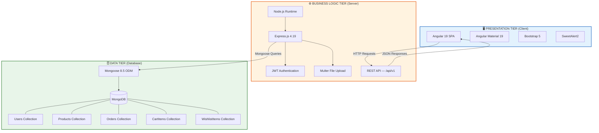

---

## 2. Entity-Relationship Diagram (ERD)

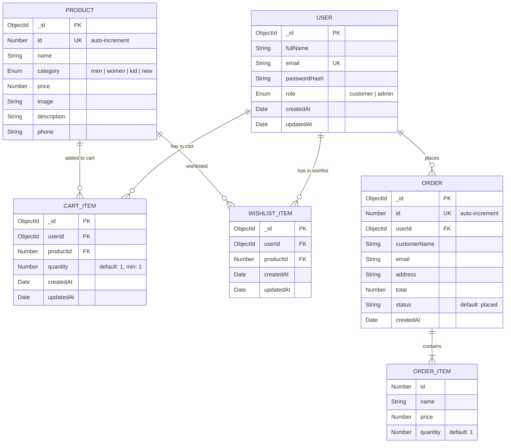

---

## 3. Data Flow Diagram — Level 0 (Context Diagram)

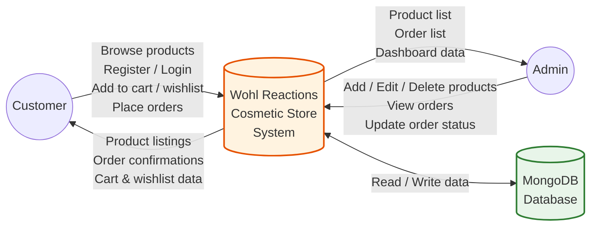

---

## 4. Data Flow Diagram — Level 1

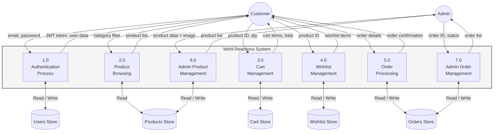

---

## 5. User Authentication Flow

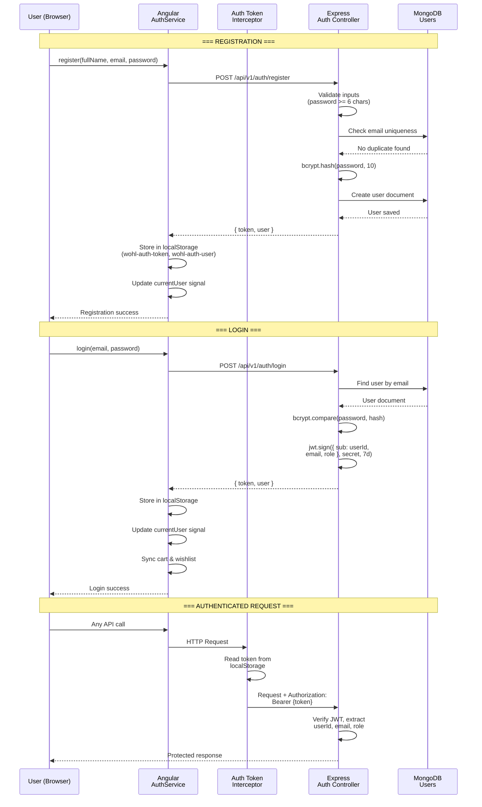

---

## 6. Order Placement Flow

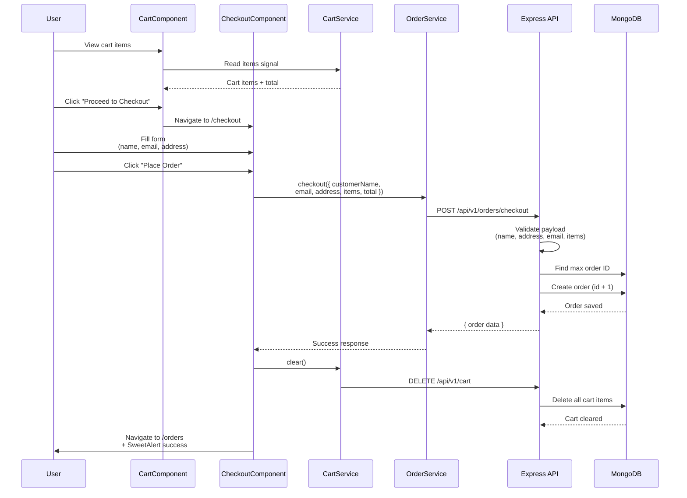

---

## 7. Admin Authentication Flow

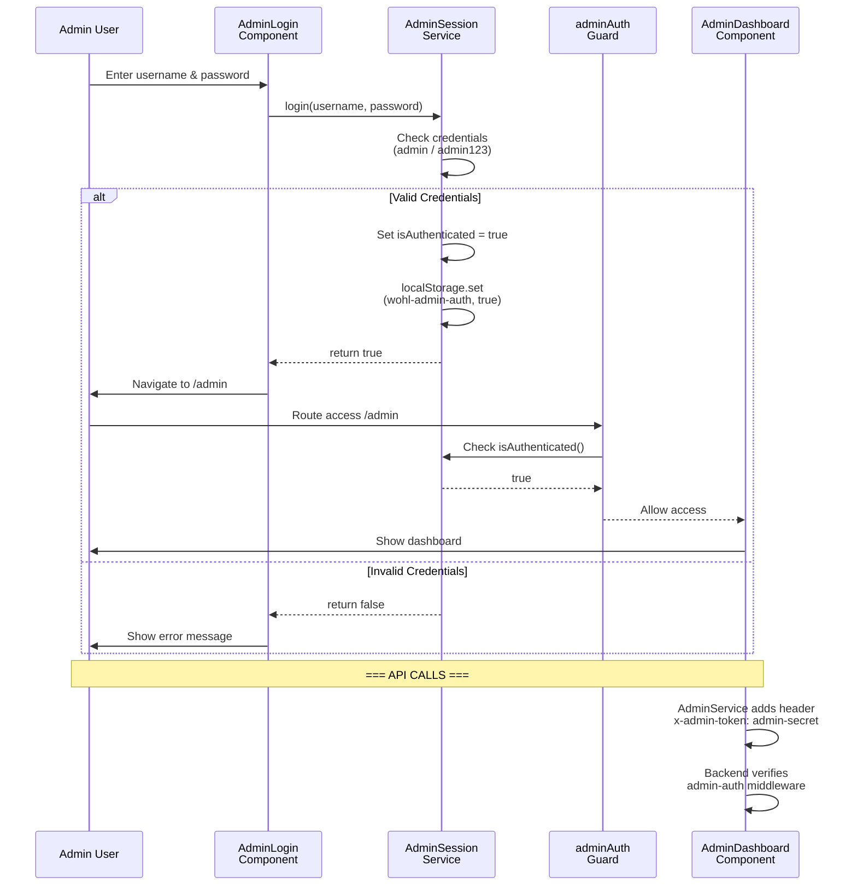

---

## 8. Product Management Flow (Admin)

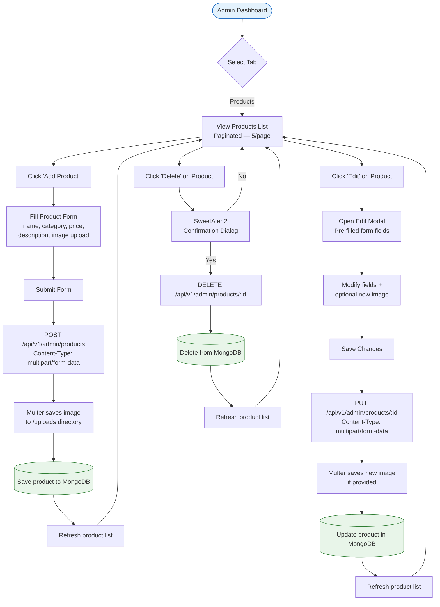

---

## 9. Frontend Component Hierarchy

```mermaid
graph TB
    Root["AppComponent<br/>(Root)"]

    Root --> Navbar["Navbar<br/>(mat-toolbar)"]
    Root --> Router["RouterOutlet"]
    Root --> Footer["Footer Section"]

    subgraph Pages["Page Components"]
        Router --> Home["HomeComponent"]
        Router --> Shop["ShopComponent"]
        Router --> PD["ProductDetailsComponent"]
        Router --> Cart["CartComponent"]
        Router --> Checkout["CheckoutComponent"]
        Router --> Orders["OrdersComponent"]
        Router --> Login["LoginComponent"]
        Router --> Register["RegisterComponent"]
        Router --> Profile["ProfileComponent"]
        Router --> Wishlist["WishlistComponent"]
        Router --> Contact["ContactComponent"]
        Router --> About["AboutComponent"]
        Router --> ForgotPw["ForgotPasswordComponent"]
    end

    subgraph CategoryPages["Category Pages"]
        Router --> Men["MenComponent"]
        Router --> Women["WomenComponent"]
        Router --> Kid["KidComponent"]
        Router --> NewArr["NewArrivalsComponent"]
    end

    subgraph AdminPages["Admin Pages"]
        Router --> ALogin["AdminLoginComponent"]
        Router --> ADash["AdminDashboardComponent"]
    end

    subgraph SharedComponents["Shared / Child Components"]
        Home --> PC1["ProductCardComponent"]
        Shop --> PC2["ProductCardComponent"]
        Men --> PC3["ProductCardComponent"]
        Women --> PC4["ProductCardComponent"]
        Kid --> PC5["ProductCardComponent"]
        NewArr --> PC6["ProductCardComponent"]
    end

    ADash --> TabDash["Dashboard Tab"]
    ADash --> TabProd["Products Tab"]
    ADash --> TabOrd["Orders Tab"]
    ADash --> EditModal["Edit Product Modal"]

    style Root fill:#e3f2fd,stroke:#1565c0,stroke-width:2px
    style Pages fill:#f5f5f5,stroke:#9e9e9e
    style CategoryPages fill:#fce4ec,stroke:#c62828
    style AdminPages fill:#fff3e0,stroke:#e65100
    style SharedComponents fill:#f3e5f5,stroke:#6a1b9a
```

---

## 10. Service Dependency Map

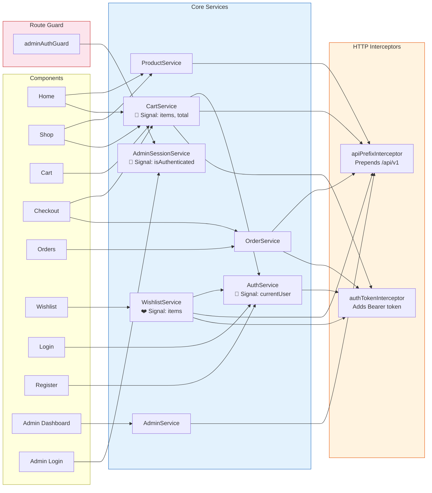

---

## 11. API Route Map

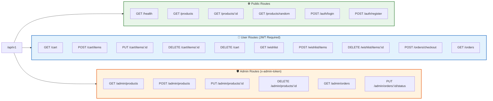

---

## 12. Angular Routing Diagram

```mermaid
graph TB
    Root["/ (Root)"]

    Root --> Home["'' → HomeComponent"]
    Root --> Shop["'shop' → ShopComponent"]
    Root --> Product["'product/:id' → ProductDetailsComponent"]
    Root --> Cart["'cart' → CartComponent"]
    Root --> Checkout["'checkout' → CheckoutComponent"]
    Root --> Orders["'orders' → OrdersComponent"]
    Root --> Profile["'profile' → ProfileComponent"]
    Root --> Wishlist["'wishlist' → WishlistComponent"]

    Root --> Login["'login' → LoginComponent"]
    Root --> Register["'register' → RegisterComponent"]
    Root --> Forgot["'forgot-password' → ForgotPasswordComponent"]

    Root --> Men["'men' → MenComponent"]
    Root --> Women["'women' → WomenComponent"]
    Root --> Kid["'kid' → KidComponent"]
    Root --> New["'new' → NewArrivalsComponent"]

    Root --> Contact["'contact' → ContactComponent"]
    Root --> About["'about' → AboutComponent"]

    Root --> ALogin["'admin/login' → AdminLoginComponent"]
    Root --> ADash["'admin' → AdminDashboardComponent"]
    Root --> NotFound["'**' → NotFoundComponent"]

    ADash ---|"🛡️ adminAuthGuard"| Guard{Authenticated?}
    Guard -->|Yes| Allow["Load Dashboard"]
    Guard -->|No| Redirect["Redirect → /admin/login"]

    style Root fill:#e3f2fd,stroke:#1565c0,stroke-width:2px
    style Guard fill:#fff3e0,stroke:#e65100
    style NotFound fill:#ffebee,stroke:#c62828
```

---

## 13. Cart & Wishlist Flow

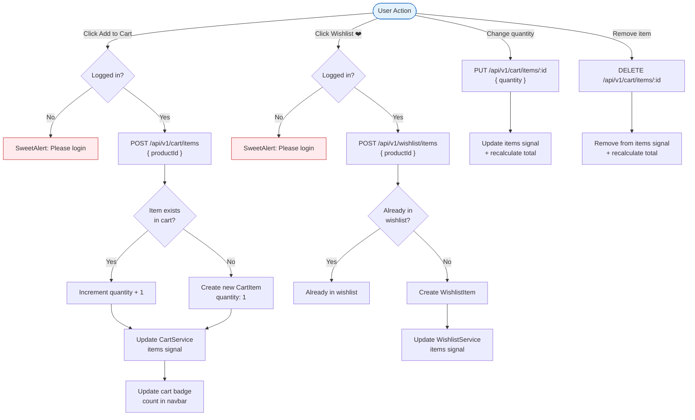

---

## 14. Deployment Architecture

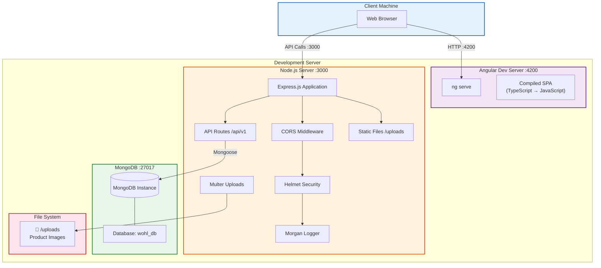

---

## 15. Order Status Lifecycle

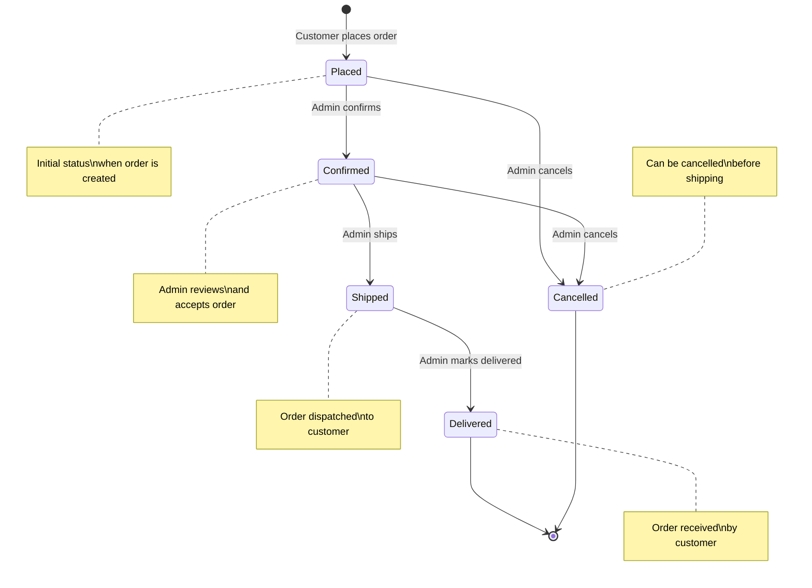

---

## 16. Database Schema Detail

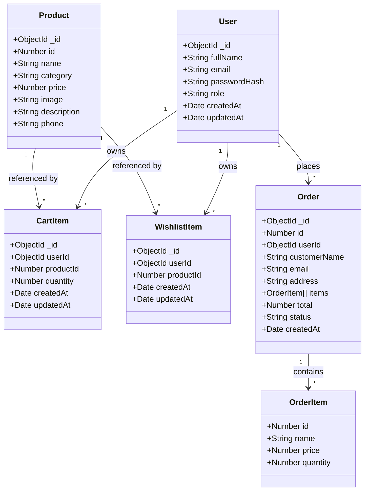

---

## 17. Middleware Pipeline

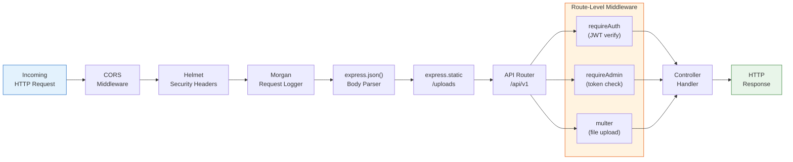

---

## 18. Signal-Based State Management

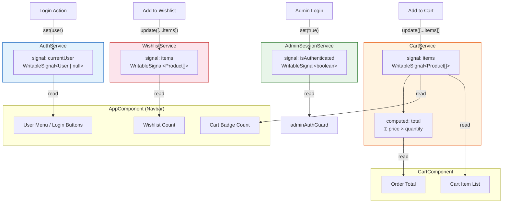

---

> **Note:** These diagrams use [Mermaid](https://mermaid.js.org/) syntax. They render automatically on **GitHub**, **GitLab**, **VS Code** (with Mermaid extension), and **Notion**. You can also paste them into the [Mermaid Live Editor](https://mermaid.live) to export as PNG/SVG for printed reports.
